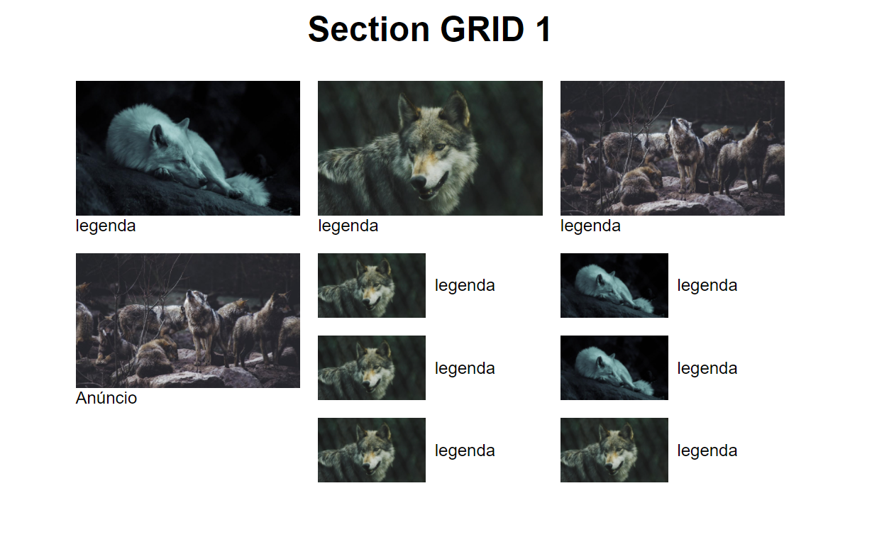

# flex-grid
Exemplo de um web site usando flex-box e grid-layout, tornando o seu site responsivo acessivel a todas as plataformas
Essa aplicação foi desenvolvida para fins de estudos

🚀 Tecnologias

- [HTML](https://developer.mozilla.org/pt-BR/docs/Webt)
- [CSS](https://developer.mozilla.org/pt-BR/docs/Web)

Feito com ❤️ por Lietson dos santos 👋🏽 Entre em contato!

